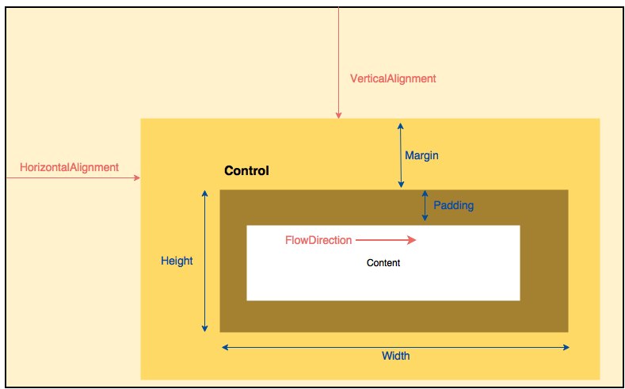

## Sizing and Positioning
Sizing and Positioning is a fundamental part of designing a GUI. 
Most properties are shown in figure 2.1.1. 
Size-related properties are shown in blue, position-related properties are shown in red.


<center>Figure 2.1.1 - Main layout properties</center>

The most of the Sizing and Positioning related properties are in the class `Layoutable`.

### Sizing
Every time the size of the GUI is changed, the child controls tell their parent about their desired size.
You can affect the size with some simple properties described in this chapter.

#### Height and Width
All layoutable controls have the `Height` and `Width` properties. There exists also `MinWidth`, `MaxWidth` and `MinHeight`, 
`MaxHeight` to set a range of sufficient values. These values are of type `Double`. 

```XML
<Button Width="120" Height="30" Content="Fixed Size" />
```

> **Warning:** Avoid setting explicit sizes! 
> This opens the risk of cutting off text when users change system font settings or if the text gets translated.

Theres also a size-related property:

- DesiredSize

The `DesiredSize` of the controls is calculated during layouting based on other properties, such as `Width`,
`Height`, `MinXXX`, and `MaxXXX`, and the amount of space its parent is currently giving it. 
It is used internally by panels.

#### Advanced Control

`MeasureOverride` and `ArrangeOverride` are the two methods which take part in the layout process. Both are `virtual` 
so you can override them as the names suggests.

The layout process is executed when an element gets rendered the first time. 
The layout system is a conversation between the layout container and its children.

This conversation is basically a two-step process which we will learn further.
- Step 1: Measure
- Step 2: Arrange

Step 1 (Measure): Following are the steps which take place in the measure process:
- Each element calculates the desired size and determines how big it wants to be.
- This is achieved by the element by calling the Measure() method on each child and access each child’s desired size property. If the child element has more child elements, in that case the child element also determines all its child’s desired size before returning its own desired size to the parent control.
- The parent can access the desired size from the previous step and calculate its own desired size.
- This process walks down the visual tree and starts at the top of level, that means the topmost parent calls the measure() method on each direct child and goes till the end.
- After this step, each element knows how big it wants to be and thus size is stored in the desired size property of each element.

Step 2 (Arrange): Following are the steps which take place in the arrange process:
- Each element arranges its child by calling Arrange() method on each direct child.
- The Arrange() method takes the final size (which we have calculated in Measure Step) and location, i.e., the element knows the position where it has to render and the size which it has to render.

After these two steps, the rendering occurs and element appears on the screen.

#### Margin and Padding
Margin and Padding relate to an control´s size.
Margin controls how much extra space gets placed around the outside edges of the control, all Layoutable controls have the margin property. Padding controls how much extra space gets places around the inside edges of the control, all Templated controls have the padding property.

```XML
<!-- Padding -->
<!-- One value for all sides -->
<TextBlock Padding="10" Text="10" />

<!-- Two values: Left/Right first value; Top/Bottom second value -->
<TextBlock Padding="10, 20" Text="10, 20" />

<!-- Four values: Left, Top, Right, Bottom -->
<TextBlock Padding="10, 20, 30, 40" Text="10, 20, 30, 40" />

<!-- Margin -->
<!-- One value for all sides -->
<TextBlock Margin="10" Text="10" />

<!-- Two values: Left/Right first value; Top/Bottom second value -->
<TextBlock Margin="10, 20" Text="10, 20" />

<!-- Four values: Left, Top, Right, Bottom -->
<TextBlock Margin="10, 20, 30, 40" Text="10, 20, 30, 40" />
```

### Positioning

#### Alignment

HorizontalAlignment
VerticalAlignment