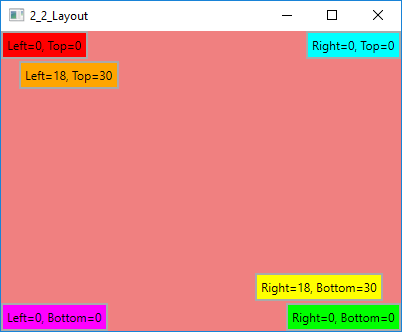
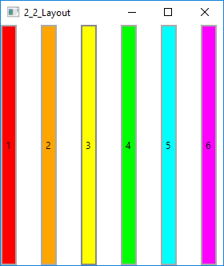
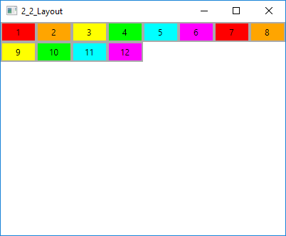
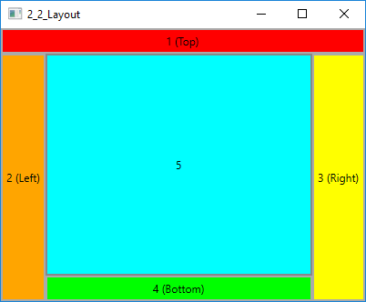
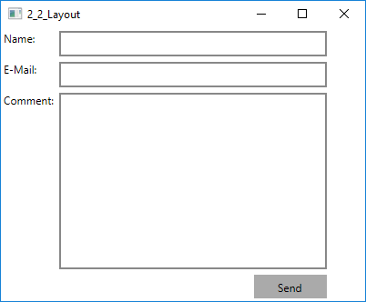
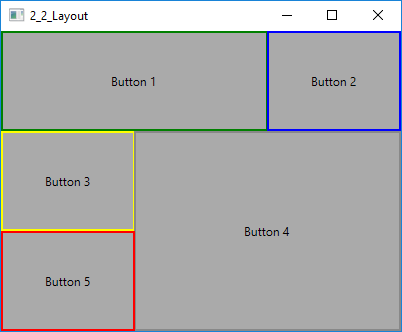
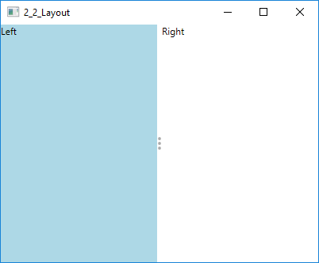

## Layout with Panels

Avalonia contains five main built-in panels, in increasing order of complexity:

+ Canvas
+ StackPanel
+ WrapPanel
+ DockPanel
+ Grid

All panels inherit form the base `Panel` class. So they have all the `Background` styled property. 
You can get the already definded colors in the class `Avalonia.Media.Colors`.

```C#
    /// <summary> 
    /// Defines the <see cref="Background"/> property. 
    /// </summary> 
    public static readonly StyledProperty<IBrush> BackgroundProperty = 
        Border.BackgroundProperty.AddOwner<Panel>(); 
```

### Canvas

Canvas is a basic panel. It supports positioning elements with explicit coordinates by using its attached properties: Left, Top, Right and Bottom. By setting a value for Left or Right, you are stating that the edge of the element should remain this fixed distance from the edge. The attached property values serve as margins. If an element doesn't use any of these attached properties, it is placed in the topleft corner of the Canvas.

> **Warning:** Elements can't use more than two of the Canvas attached properties!

```XML
	<Window x:Class="AvaloniaSamples.MainWindow"
	        xmlns="https://github.com/avaloniaui"
	        xmlns:x="http://schemas.microsoft.com/winfx/2006/xaml"
	        Title="Main Window" Width="1024" Height="800">
	
		<Canvas Background="Green">
			<Button Background="Red">Left=0, Top=0</Button>		
			<Button Canvas.Left="18" Canvas.Top="18"
					Background="Orange">Left=18, Top=18</Button>		
			<Button Canvas.Right="18" Canvas.Bottom="18"
					Background="Yellow">Right=18, Bottom=18</Button>		
			<Button Canvas.Right="0" Canvas.Bottom="0"
					Background="Lime">Right=0, Bottom=0</Button>		
			<Button Canvas.Right="0" Canvas.Top="0"
					Background="Aqua">Right=0, Top=0</Button>
			<Button Canvas.Left="0" Canvas.Bottom="0"
					Background="Magenta">Left=0, Bottom=0</Button>
		</Canvas>
	    
	</Window>
```

<center></center>
<center>Figure 2.2.1 - Canvas</center>

### StackPanel

StackPanel is a useful panel. It simply stacks its children sequentially according to the Orientation property. The Orientation property can be set to Horizontal or Vertical (default). There is also a Gap property which can be set to place a gap between the childrens.

| Property      | Description                                                   | Default
| -----------   | ------------------                                            | ---------- 
| Orientation   | The orientation in which child controls will be layed out.    | Vertical
| Gap           | The size of the gap to place between child controls.          | 0


```XML
	<Window x:Class="AvaloniaSamples.MainWindow"
	        xmlns="https://github.com/avaloniaui"
	        xmlns:x="http://schemas.microsoft.com/winfx/2006/xaml"
	        Title="Main Window" Width="1024" Height="800">
		
		<StackPanel Orientation="Horizontal" Gap="5">
			<Button Background="Red">1</Button>		
			<Button Background="Orange">2</Button>		
			<Button Background="Yellow">3</Button>		
			<Button Background="Lime">4</Button>		
			<Button Background="Aqua">5</Button>
			<Button Background="Magenta">6</Button>
		</StackPanel>

	</Window>
```

<center></center>
<center>Figure 2.2.2 - StackPanel</center>

### WrapPanel

WrapPanel is similar to the StackPanel. But in addition to stacking its child elements, it wraps them to additional rows or columns when there’s not enough space.

| Property      | Description                                                   | Default
| -----------   | ------------------                                            | ---------- 
| Orientation   | The orientation in which child controls will be layed out.    | Horizontal

```XML
    <WrapPanel>
        <Button Background="Red" Width="50">1</Button>
        <Button Background="Orange" Width="50">2</Button>
        <Button Background="Yellow" Width="50">3</Button>
        <Button Background="Lime" Width="50">4</Button>
        <Button Background="Aqua" Width="50">5</Button>
        <Button Background="Magenta" Width="50">6</Button>
        <Button Background="Red" Width="50">7</Button>
        <Button Background="Orange" Width="50">8</Button>
        <Button Background="Yellow" Width="50">9</Button>
        <Button Background="Lime" Width="50">10</Button>
        <Button Background="Aqua" Width="50">11</Button>
        <Button Background="Magenta" Width="50">12</Button>
    </WrapPanel>
```

In the following example the buttons gets wrapped to the next row after eight button.

<center></center>
<center>Figure 2.2.3 - WrapPanel</center>

### DockPanel

DockPanel enables easy docking of elements to a side of the panel, stretching it to fill the entire width or height. DockPanel also enables an element to fill all the remaining space unused by the docked elements.

| Property      | Description                                                   | Default
| -----------   | ------------------                                            | ---------- 
| Dock          | The side to which the children will be docked.                | Left
| LastChildFill | Indicates whether the last child of the DockPanel fills the remaining space in the panel. | True

```XML
    <Window x:Class="AvaloniaSamples.MainWindow"
            xmlns="https://github.com/avaloniaui"
            xmlns:x="http://schemas.microsoft.com/winfx/2006/xaml"
            Title="Main Window" Width="1024" Height="800">
		
        <DockPanel LastChildFill="True">
            <Button DockPanel.Dock="Top" Background="Red">1 (Top)</Button>
            <Button DockPanel.Dock="Left" Background="Orange">2 (Left)</Button>
            <Button DockPanel.Dock="Right" Background="Yellow">3 (Right)</Button>
            <Button DockPanel.Dock="Bottom" Background="Lime">4 (Bottom)</Button>
            <Button Background="Aqua">5</Button>
        </DockPanel>

    </Window>
```

<center></center>
<center>Figure 2.2.4 - DockPanel</center>

### Grid

The grid is a layout panel that arranges its child controls in a tabular structure of rows and columns.

#### Define Rows and Columns

The grid has one row and column by default. To create additional rows and columns, 
you have to add RowDefinition items to the RowDefinitions collection and ColumnDefinition items 
to the ColumnDefinitions collection and use the attached property to give the child elements
the row/column index.

It is just a comma-separated list with following options:

|       Value          |      Description     |
|----------------------|----------------------|
|Fixed, e.g. 200       | Fixed size of logical units (1/96 inch)
|Auto                  | Takes as much space as needed by the contained control
|Star                  | Takes as much space as available (after filling all auto and fixed sized columns), proportionally divided over all star-sized columns. So 3*/5* means the same as 30*/50*. Remember that star-sizing does not work if the grid size is calculated based on its content. 

An example shows following formular:

```XML
    <Grid ColumnDefinitions="Auto, 300" RowDefinitions="Auto, Auto, *, 32">
        <TextBlock Grid.Column="0" Grid.Row="0" Margin="3" Text="Name:"/>
        <TextBlock Grid.Column="0" Grid.Row="1" Margin="3" Text="E-Mail:"/>
        <TextBlock Grid.Column="0" Grid.Row="2" Margin="3" Text="Comment:"/>
        
        <TextBox Grid.Column="1" Grid.Row="0" Margin="3"/>
        <TextBox Grid.Column="1" Grid.Row="1" Margin="3"/>
        <TextBox Grid.Column="1" Grid.Row="2" Margin="3"/>
        
        <Button Grid.Column="1" Grid.Row="3" HorizontalAlignment="Right" 
                MinWidth="80" Margin="3" Content="Send"/>
    </Grid>
```

<center></center>
<center>Figure 2.2.5 - Grid</center>

#### Grid Span

The default Grid behavior is that each control takes up one cell, but sometimes you want a certain control 
to take up more rows or columns. 
Fortunately the Grid makes this very easy, with the Attached properties ColumnSpan and RowSpan. 
The default value for this property is obviously 1, but you can specify a bigger number to make the control 
span more rows or columns. 

```XML
    <Grid ColumnDefinitions="*, *, *" RowDefinitions="*, *, *">
        <Button Grid.ColumnSpan="2" BorderBrush="Green">Button 1</Button>
        <Button Grid.Column="3" BorderBrush="Blue">Button 2</Button>
        <Button Grid.Row="1" BorderBrush="Yellow">Button 3</Button>
        <Button Grid.Column="1" Grid.Row="1" Grid.RowSpan="2" Grid.ColumnSpan="2" BorderBrush="Black">Button 4</Button>
        <Button Grid.Column="0" Grid.Row="2" BorderBrush="Red">Button 5</Button>
    </Grid>
```

<center></center>
<center>Figure 2.2.6 - Grid</center>

#### Grid Splitter

A `GridSplitter` can be used to  redistribute the space between two columns in a Grid without changing the dimensions of the Grid. 

```XML
    <Grid ColumnDefinitions="*, Auto, *" RowDefinitions="300">        
        <TextBlock Grid.Column="0" Text="Left"/>
        <GridSplitter Grid.Column="1" />
        <TextBlock Grid.Column="2" Text="Right"/>
    </Grid>
```

<center></center>
<center>Figure 2.2.7 - GridSplitter</center>