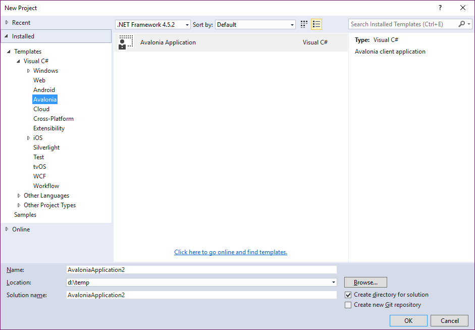

## Create an Applications

### Using the extension

For Visual Studio there is an 
[Extension](https://marketplace.visualstudio.com/items?itemName=AvaloniaTeam.AvaloniaforVisualStudio) 
for starting programming with avalonia.

Figure 2.5.1 - Avalonia extension

### Creating the main routine for desktop applications

The main routine for creating an app and starting a window looks like:

    static void Main(string[] args)
    {
        AppBuilder.Configure<App>()
            .UsePlatformDetect()
            .Start<MainWindow>();
    }

The `MainWindow` is just a class derived from `Window`.

    public class MainWindow : Window
    {
        public MainWindow()
        {
            Title = "This is my first avalonia window!";
        }
    }

### The app builder class

The app builder "builds" the application and also "hosts" the app class in the property `Instance`. 
If you call the `Configure` method in the `Appbuilder` class it returns the `Appbuilder` instance so you can gradually
build your app with the methods provided.

The method `Configure` has two overloads. One which will takes an instance of the application class 
and one that creates an instance of the application class for you:

    public static AppBuilder Configure(Application app);
    public static AppBuilder Configure<TApp>() where TApp : Application, new();

The `UsePlatformDetect` method Instructs the `Appbuilder` to use the best settings for the platform. 
This method should be used over the other methods: `UseWindowSubsystem` and `UseRenderingSubsystem`.

    public AppBuilder UsePlatformDetect();

In the `UseWindowSubsystem` methods you can specify which window subsystem you want to use.

    public TAppBuilder UseWindowingSubsystem(string dll);
    public TAppBuilder UseWindowingSubsystem(Action initializer, string name = "");

The `UseRenderingSubsystem` can be used for specifying the rendering subsystem. 

    public AppBuilder UseRenderingSubsystem(string dll);
    public AppBuilder UseRenderingSubsystem(Action initializer, string name = "");

The `AfterSetup` method takes a callback as an argument which will be called **after** the application is configured.

    public AppBuilder AfterSetup(Action<TAppBuilder> callback); 

The `BeforeStarting` method takes a callback as an argument which will be called **before** the application starts.

    public AppBuilder BeforeStarting(Action<TAppBuilder> callback);

There are two ways for starting the application

    public AppBuilder SetupWithoutStarting();

which setups the application without running it. The application can be runned in this way

    builder.Instance.RunWithMainWindow<TMainWindow>();

and the other way is

    public void Start<TMainWindow>(Func<object> dataContextProvider = null) 
        where TMainWindow : Window, new();

    public void Start<TMainWindow>(TMainWindow mainWindow, Func<object> dataContextProvider = null) 
        where TMainWindow : Window;

which creates an instance of the window class or takes an instance, runs the application and start the window. 
The dataContextProvideris a delegate that will be called to create a data context for the window.

### The application class

