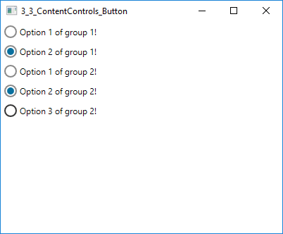

## Content Controls

### Button

A button is a content control that can be clicked. Double clicking ist noch possible. 
This behaviour is captured by the `Button` class which is the base for all button types:
* RadioButton
* RepeatButton
* ToogleButton
* CheckBox

It inherits all properties from `ContentControl` especially the content property which
let you specify a content like a text etc.

The `Button` class contains the `Click` event. A click can occur pressing down the left mouse button
and then letting up from the keyboard with Enter or spacebar, if the `Button` was focused.
It is possible to trigger the `Click` event with [behaviours](../Chapter-4/4_3_Behaviours.md).

The base class `Button` contains following Avalonia properties:

|       Property       |      Description     |
|----------------------|----------------------|
|Command               |Lets specify a ICommand that gets called when the button is clicked
|CommandParameter      |The parameter that the ICommand gets when the button is clicked
|ClickMode             |This can be set to a value of a ClickMode enumeration to control exactly when the Click event gets raised. Its values are Release (the default) and Press.
|HotKey                |A hot key can be set
|IsDefault             |Set to true, pressing Enter causes the Button to be clicked unless focus is explicitly taken away from it.
|IsPressed             |Indicates wheter the button is pressed in case you want to act on pressed state

Following example shows a button with a binded command.

    <Button Content="I am a Button!" Command="{Binding ClickCommand}" CommandParameter={Binding} />

In the view model there is a ClickCommand.

    public ReactiveCommand<object> ClickCommand { get; set; }

With "Binding" without specifying any path you get the ViewModel in the argument of the executing method.

#### RepeatButton

not implemented yet...

#### ToggleButton

The `ToggleButton` has the additional property `IsChecked` which also changes the style of
the button (see Figure 3.3.X).

    <ToggleButton Content="I am a ToggleButton!" />
    <ToggleButton Content="I am a checked ToggleButton!" IsChecked="true" />

Figure 3.3.X - Toggle Button

#### RadioButton

`RadioButton` inherits from `ToggleButton` so it also has the `IsChecked` property.
It can be grouped. The grouping takes place under the parent control.

    <!--Group 1-->
    <StackPanel>
        <RadioButton Content="I am a RadioButton!" />
        <RadioButton Content="I am a RadioButton 2!" />
    </StackPanel>

    <!--Group 2-->
    <StackPanel>
       <RadioButton Content="I am a RadioButton!" />
        <RadioButton Content="I am a RadioButton 2!" />
    </StackPanel>

Figure 3.3.X - Toggle Button

#### CheckBox

`CheckBox` inherits from `ToggleButton`  so it also has the `IsChecked` property.

Figure 3.3.X - Toggle Button
